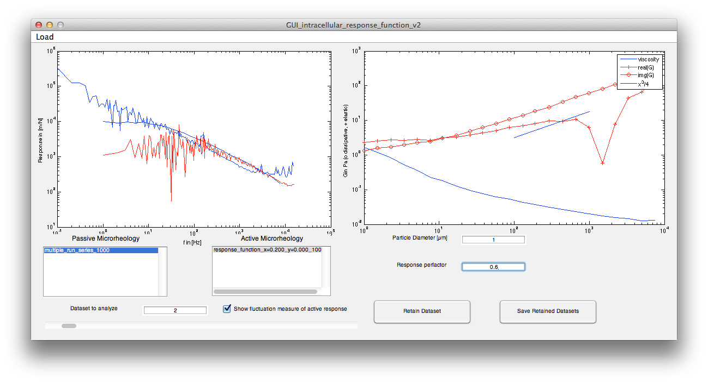

# Annalyse response function

Program to analyse passive fluctuation and active response of sample 
from data generated by the setup first floor. 

Run `GUI_intracellular_response_function_v2` from inside matlab command line.

